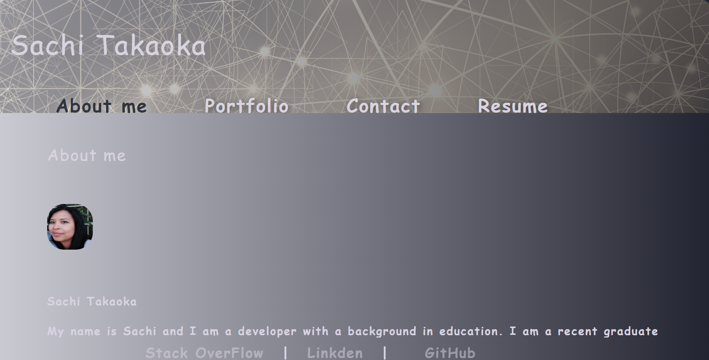

# Portfolio2.0

[](https://opensource.org/licenses/MIT)

## Overview
```
Portfolio2.0 is a redo of my portfolio using React. 


```
## Table of Contents

- [Technology Used](#technlogy-used)
- [Screenshot](#screenshot)
- [Acceptance Criteria](#acceptance-criteria)
- [Challenges](#challenges)
- [Future Enhancements](#future-enhancements)
- [Installation](#installation)
- [Usage](#usage)
- [License](#license)
- [Contributing](#contributing)
- [Special Thank you](#special-thank-you)
- [Credits](#credits)

## Technology Used
[](https://www.javascript.com)
[](https://www.javascript.com)
[](https://www.javascript.com)
[](https://www.javascript.com)
[](https://www.javascript.com)

## Screenshot
## Demo/Screenshot

<table>
<tr>
<td></td>
</tr>
</table>


## Acceptance Criteria
```md
WHEN I open this app
THEN I am presented with the "About Me" page

WHEN I click on the links
THEN I am presented with pages for the portfolio, resume, and contact
WHEN I visit the contact page
THEN I am able to enter my information
This would include:
-	Name
-	Email
-	Message

```
## Challenges
- Frontend Components
- I created this repo twice because I wanted to try to use a different method to create the portfolio. I was able to get the portfolio to render but I was not able to get the images to render. I was able to get the images to render on the first repo but I was not able to get the portfolio to render. I decided to go with the repo that rendered the portfolio. I will continue to work on the repo that renders the images.

## Future Enhancements
- Add additional styling
- Add additional pages

## Installation

To install the necessary dependencies, run the following command:

```Visit github and clone the repo. Run npm install to install all dependencies.```

-  [Link to repo](https://github.com/kaleikautakaoka/Portfolio2.0.git)


## Usage

```Visit the deployed site```
```Click on the links to navigate through the site```

-  [Deployment](https://kaleikautakaoka.github.io/Portfolio2.0/)


## License

[](https://opensource.org/licenses/MIT)


## Contributor
- Sachi Kaleikau-Takaoka 

## Special Thank you
- Phil Loy
- Rob Johnson

## Credits
Image by <a href="https://pixabay.com/users/geralt-9301/?utm_source=link-attribution&utm_medium=referral&utm_campaign=image&utm_content=4636686">Gerd Altmann</a> from <a href="https://pixabay.com//?utm_source=link-attribution&utm_medium=referral&utm_campaign=image&utm_content=4636686">Pixabay</a>